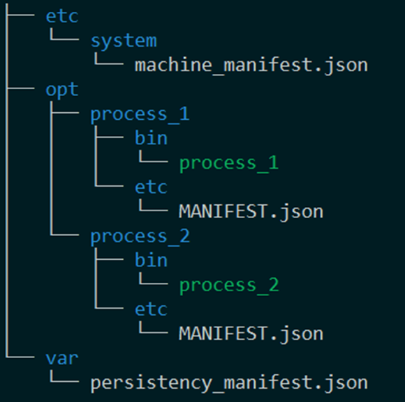
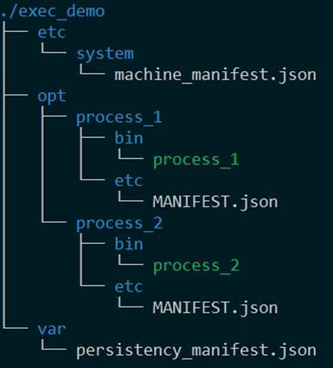

***************
1. Introduction
***************

This chapter describes the followings:

* The concept and features of Execution Management in the context of mobilgene Adaptive
* Roles of Execution Management in Adaptive development

1.1 What is EXEC(Execution Management)
=======================================

EXEC(Execution Management) is a functional cluster contained in the Adaptive Platform Foundation.

EM(Execution Manager) is launched as part of the Adaptive Platform startup phase.
EXEC is responsible for the initialization of the platform and deployed Applications.
EXEC works in conjunction with the Operating System.

In particular, EXEC is responsible for configuring the Operating System to perform run-time scheduling and resource monitoring of Applications.

The features of Execution Management

* EM launches the adaptive applications by their each startup configuration.
* EM starts/terminates each application according to function group state
* After modeling the machine related setting in ARXML, users can develop an Adaptive Applications using machine and execution manifest file generated by mobilgene Generator and the ara::exec API.

1.2 Overview
============
Execution Management is consisted of two parts of Execution Manager daemon and the EXEC library.
Execution Manager daemon manages the Adaptive applications and the system resources.
The EXEC library connecting between Adaptive applications and Execution Manager is linked when Adaptive application is compiled. For more detailed descriptions, see 4.4 Building Adaptive Applications.

1.2.1 ARXML files and Manifest files
------------------------------------
Machine and application settings are in format of ARXML file.
For the detailed information about the AUTOSAR ARXML files specification,
please see the user manual of mobilgene A Studio or AUTOSAR_TPS_ManifestSpecification.

``mobilgene Generator`` is a code and file generator that runs on mobilgene Adaptive.
It is used in the CMake script because mobilgene Adaptive supports the wrapper function in ``CMake``.

It uses an ``ARXML`` file that defines platform-related settings as input to generate source codes (.cpp/.h) and manifests (.json) to be used for build and run.

These generated manifest file like machine manifest and application manifest will be installed on the target by CMake.
When Execution Manager is starting, these generated manifest files(.json) are loaded and parsed. Then all the adaptive applications will be working based on these manifest files.

1.2.2 ARA_ROOT parameter
------------------------
The structure of ``ARA_ROOT`` is follows:

    Figure 1.2.2-a Directory structure under the ``ARA_ROOT``

ARA_ROOT is the supposed root directory from which EM will start.

Machine manifest json format file that has machine information is supposed to be detected under the ``${ARA_ROOT}/etc/system/machine_manifest.json``.

EM will search the ``${ARA_ROOT}/opt`` directory in order to search the applications with their each application manifest file (``opt/process_1/etc/MANIFEST.json`` and ``opt/process_2/etc/MANIFEST.json``). EM will iterate each application directory (like ``/opt/process_1`` and ``/opt/process_2``), then check the binary file under bin directory and inspect their each application manifest file under etc.
When launching the execution-manager that is under ``${your_path_of_installed_platform}/bin`` ARA_ROOT parameter can be passed.

After this execution, EM will explorer the application and application manifest file under ``“/adar/install/sampleApp/exec_demo”`` directory.

    Figure 1.2.2-b Directory structure under the ``ARA_ROOT``\(``/adar/install/sampleApp/exec_demo``)

.. warning:: If “Caught exception: 'Permission denied with /usr/run/execution-manager/sysstate-server-fifo'”error is occurring when EM is executed. Please follow the next guide.

Please check the system directory existence and the permission,
whether execution permission ``/usr/run/execution-manager`` is granted or not for the current user

If the directory doesn’t exist, please run next command.

.. prompt:: bash $

    sudo mkdir -p /usr/run
    sudo mkdir -p /usr/run/execution-manager
    sudo chown -R $(whoami):$(whoami) /usr/run/execution-manager

