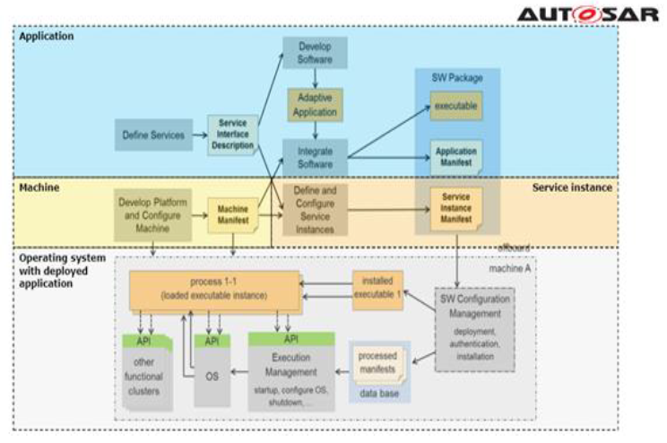
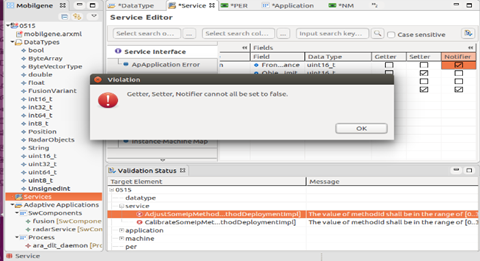
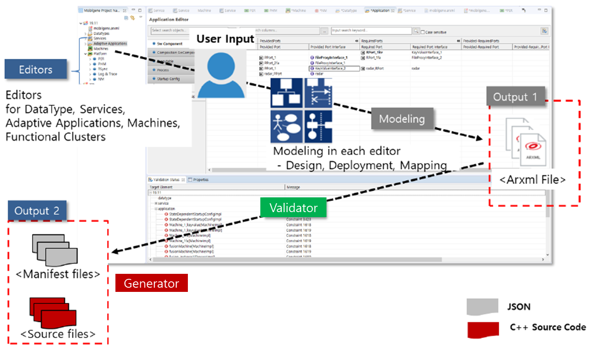

****************
1. Introduction
****************

This chapter describes:

* The concept and features of Execution Management in the context of mobilgene Adaptive
* Roles of Execution Management in Adaptive development

|
1.1 What is mobilgene A Studio™
=======================================

mobilgene A studio™ is a powerful modeling tool for Adaptive AUTOSAR system and software.

| mobilgene A studio supports comprehensive Adapitve modeling workflow based on the AUTOSAR Methodology
| and provides convenient User Interface(UI) and Editors for each modeling type.

| Therefore, users can design and configure AUTOSAR elements efficiently and quickly with easy-to-use functions and wizards, and Editors.

| Figure 1.1_1 Modeling approach based on the AUTOSAR Methodology
|
mobilgene A studio provides the following features.

* Modeling with GUI-based Editor and Text-based Editor
* Modelig Validation according to the Manifest specification
* Generation of C++ codes and Manifests from ARXMLs
* ARXML and ARPackage Management
* Usefule functions for modeling, such as Drag & Drop, Notifying Changes, and Multi Delete

| Figure 1.1_2 User Interface Environment of mobilgene A Studio 
|
|
1.2 The Roles of mobilgene A Studio in Adaptive ECU Development
=================================================================

mobilgene A Studio supports comprehensive Adapitve modeling workflow based on the AUTOSAR Methodology.

mobilgene A Studio provides the following methods and process in Adaptive Development

* Modeling Adaptive Applications, Services, Machines, Functional Clusters services in the ARXML format.
* Validation for specification consistency
* Generating C++ codes and Manifests in the JSON format for use in Adaptive ECU development.

| Figure 1.2_1 Roles of mobilgene A Studio in Adaptive ECU Development 

