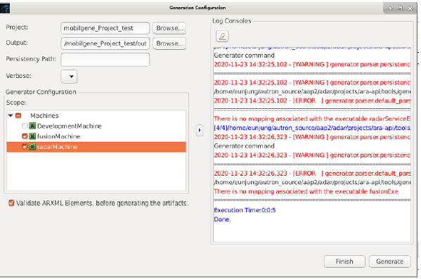
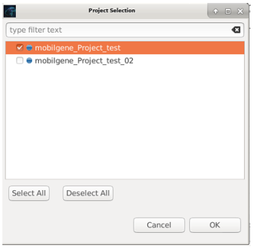

*****************
3. Tool Overview
*****************

| This chapter describes the mobilgene A Studio User Interface(UI) and how major functions,
| such as Editor, Validator, and Generator consist in the UI.

|
3.1 User Interface
=====================

| The mobilgene A Studio UI consists of **Toolbar**, **Project Navigator**, **Editor**, and **Validation Status**.
| You can navigate, create, and modify model elements and data with the UI components. 

.. image:: ../_static/tool/images/3.1.png
| Figure 3.1 User Interface in mobilgene A Studio

|
3.2 Editor
===============

Editor is a visual component and used to modify data or browse a resource.

| In mobilgene Project, Editor is used to model AUTOSAR software and system.
| The Editor UI is composed of **Search Bar**, **ARPackage Viewer**, and **Grid View** as follows.

.. image:: ../_static/tool/images/3.2.png
| Figure 3.2 Editor UI components (e.g. Application Editor)

|
3.2.1 Editor Components
--------------------------

* | :ref:`Grid View <doc_tool_getting_started>` : shows modeling element types, attributes, and values through three parts including tabs, columns, and input cells as follows.
  | It provides intuitive functions to allow you model easier.
  
  .. image:: ../_static/tool/images/3.2.1.png
  | Figure 3.2.1 Grid View components of Editor (e.g. Service Editor)

* | :ref:`ARPackage Viewer <doc_tool_getting_started>` : shows all imported ARXML files, including the default ARXML files created in the current project. 
  | In addition, the elements created in **Grid View** can be placed in a desired package through the **Set Default Path** and **Add Package** function of **ARPackage Viewer**.

* | :ref:`Search Bar <doc_tool_getting_started>` : finds the desired keyword for element objects, columns, and cell values of each tab existing 
  | in **Grid View** and displays the corresponding result value for the element.

Editor of mobilgene A Studio has the following different types which depending on the AUTOSAR modeling elements in:

* Data Type Editor: Definition of Application, Implementation Data Type
* Service Editor: Design of Service Interface, Deployment of Service Interface and Instance, Mapping of Service Instance to Machine and Port
* Application Editor: Design of Adaptive Applications(SwComponentType, Executable, Process), Mapping of Process to Machine
* Machine Editor: Design of Machines, Processors, Memory, Network Connection
* Functional Cluster Editor: Design and Deployment of Functional Cluster’s Interfaces, services in order to interaction of application software 
| with the platform.
|     - PER, PHM, TSync, LOG, NM, IAM, UCM Editor

Each Editor above is in the form of a hierarchical type in mobilgene Project Navigator as follows, you can open the the Editor by double-click.

.. note:: TSync, LOG, NM Editors are not covered in this mobilgene A Studio release version.

|
3.3 mobilgene Generator
=========================
|
3.3.1 What is mobilgene Generator
-----------------------------------

| mobilgene Generator, as one of the functions provided by mobilgene A Studio, provides UI-based code generation wizard by calling ARA Generator.
| It uses the ARXML file configured in mobilgene A Studio to generate source codes(.cpp/.h) and manifests(.json).
| Therefore, you can perform from modeling to generation by one authoring tool that is mbilgene A Studio.

.. note:: For more information about how to use ARA Generator in mobilgene Adaptive, 
  see the User Manual of each Functional Cluster.

.. hint:: It is recommended to use ARA Generator included in mobilgene Adaptive, 
  please see Release Notes of mobilgene A Studio for the Generator version.

| * What scope does it generate
| It generates `C++` codes and `JSON` files for the following Functional Clusters.
| You can generate the files for the FCs by selecting related Machines in ARXML you have configured in mobilgene A Studio.
|   - Communication Management(COM)
|   - Platform Health Management(PHM)
|   - Persistency(PER)
|   - Execution Management(EXEC)

.. note:: You can generate all codes and manifests for use of the above FCs in a UI-based integrated way.

|
3.3.2 How to use mobilgene Generator
--------------------------------------

For setting up and using mobilgene Generator, use the following steps:

| 1) In Project Navigator, choose project you generate codes and files for.
| 2) Click **mobilgene Generator** on the top Toolbar.
| (Or select **mobilgene > Generator…** from the main menu)

| 3) The **mobilgene Generator** window pops up when it is a first setting for Generator, click **Yes**.

| 4) In **Preferences**, set the Generator path by **Browse..**.
| The path is the local directory where the Generator file ( aragen file) is located.
| Select the **aragen** file in the path and click **OK**.

| 5) Check the Generator path is set as you intend and click **Apply and Close**.

.. note:: The Generator path in the figure above is where the **aragen** executable file is
    located in the distributed platform.
  
| You can see the pop-up **Generation Configuration** window.
| (Click the mobilgene Generator icon on the toolbar next time you run the Generator)
| In the **Generation Configuration** window, select **Machines** in the Scope section and click **Generate**.

.. note:: A Machine contains the information about ARXML-based Application,
   Network Connection, and Machine State you configured in mobilgene A Studio.

   Therefore, for FC-related Generators that require an Executable or SW Components 
   as input, it use an Executable and SW Components connected to the selected Machine based on PROCESS-TO-MACHINE-MAPPING. 

.. hint:: You can set the logging level of the Generator by selecting the **Verbose** option as set to ‘3’ in the figure above.

.. warning:: When you use Persistency File Storage related ARXML as input, 
  you should type **Content URI** in absolute path format for the Persistency initial file('.txt file') as follows:
  
  For more information about setting **Content URI** in your PC, 
  see Chapter Setting Content URI for File Storage in the User Manual of Persistency.

  .. image:: ../_static/tool/images/3.3.2_6.png

| 6) You check the generation result in the Log Consoles section and click **Finish**.

| 7) Codes and Manifests are generated in the out folder where you set as Output as follows:

|
3.4 mobilgene Validator
==========================
|
3.4.1 What is mobilgene Validator
-----------------------------------

| mobilgene A Studio provides a validation function to report errors in modeling.
| The modeling validation result is shown in the **Validation Status** at the bottom of the UI.

| You can check the details of the selected error in Selected Item Description on the left.

* What does **mobilgene Validator** provide

| mobilgene Validator checks maturity for the configured and set models in mobilgene project as follows:
|   - **Restrictions**: Passive guidance of input limitation in editor cells
 
  .. image:: ../_static/tool/images/3.4.1_2.png

|   - **Error Detection & Redirection**: Active guidance to fix values according to logical errors 
|     and constraints via the **Validation Status** view

  .. image:: ../_static/tool/images/3.4.1_3.png
|
3.4.2 How to use mobilgene Validator
--------------------------------------

| To use **mobilgene Validator**, click the mobilgene Validator icon on the top Toolbar.

|Select the project to use the mobilgene Validator function and click **OK**.

| In the **Validation Status** window, you can check the modeling validation results for each element you create.
| The validation result of newly created elements is highlighted in yellow as follows:
