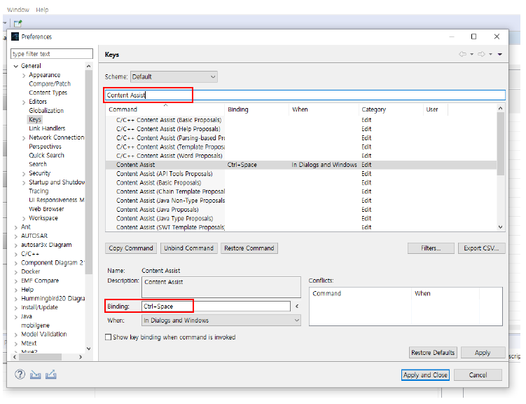

.. _doc_tool_getting_started:

******************************************
4. Getting Started with mobilgene A Studio
******************************************

This chapter explains how to use mobilgene A Studio for the first time, including using GUI components, handling project, and useful functions.

|
4.1 Running mobilgene A Studio
================================

| This chapter describes how to start mobilgene A Studio.
| Before starting mobilgene A Studio on your computer, you need to receive a execute program in the ``*.tar.zip`` format from Autron.

| To start mobilgene A Studio from the execute program(tar.zip file), use the following steps:

| 1) Extract the given execute program(tar.zip file) into your chosen directory.
| 2) Double-click the mobilgene file in the folder where you extracted the file to launch.

.. warning:: Before launching mobilgene A Studio, make sure you have the proper version of *JDK* and *Python* installed.
 
    A startup error appears when the **mobilgene** file does not compatible with your operating system or Java installation version.

| 3) Set Workspace directory to store your configuration and workspace data by **Browse..** on Eclipse Launcher, and click **Launch**.

.. warning:: Before launching mobilgene A Studio, you need to get mobilgene A Studio license file and install.
  
    For more information of how to get the license file, see the License Guide of mobilgene A Studio.

| 4) After launching, the empty mobilgene Perspective view appears:

|
4.2 Handling mobilgene Project
=================================

| This chapter describes how to handle a project in mobligene A Studio. 
| You can handle several projects in **mobilgene Project Navigator** by creating, importing ARXMLs, etc.

|
4.2.1 Creating a New Project
------------------------------

| 1) Click the **New** icon to create a new project from the **Tool Bar** (Or right-click in mobilgene Project Navigator).

| 2) Select the **mobilgene Project** icon in the New wizard.

| 3) Define the short name for Project and ARXML.

| If you name the project and ARXML as follows, you cannot proceed to next step.

.. warning:: You should follow the naming convention for the *[a-zA-Z][a-zA-Z0-9_]** pattern when naming the Project and Package.
   
   In the *[a-zA-Z][a-zA-Z0-9_]** pattern, the first letter must start with an alphabet regardless of uppercase and lowercase letters, 
   after that, the alphabet and number are allowed without any limit.

| 4) Click **Finish** to create the project.

|
4.2.2 Deleting Projects and ARXMLs
---------------------------------------

You can delete several projects and ARXMLs at once in **mobilgene Project Navigator**.

| 1) Select multiple same type of files(projects or ARXMLs) with the *Ctrl* or *Shift* Key.
| 2) Click **OK** to delete immediately, or click **Preview** to check the files to delete.

|
4.3 Handling ARXMLs
======================

| When you create a mobilgene project, two ARXML files are created by default as follows.

| One of the files is **mobilgene_SDG_1911.arxml** and the name is fixed. This file is not viewed in **ARPackage Viewer**.
| The other ARXML file is created with the name defined when creating a mobilgene project.

|
4.3.1 Creating a New ARXML file
---------------------------------

| You can create a new ARXML file in your project as follows:

| 1) Click the ▼ icon from Toolbar and select **ARXML File** (Or press *Ctrl+N*).

| 2) Select a project and parent folder for the ARXML.

| 3) Define the ARXML file and ARPackage name. You cannot create names that exist in the same project directory.

| 4) Click **Finish** and Check that the ARXML file is created in **mobilgene Project Navigator**.

|
4.3.2 Importing ARXMLs
---------------------------------

| You can import ARXML files after creating a project.
| To Import ARXML files to your project, proceed the following steps:

| 1) Click **+** from Toolbar and select the project to import ARXML.

| Other way) Right-click the project in **mobilgene Project Navigator** and select **Import**.
| In the Import wizard, select **mobilgene A Studio > ARXMLs from File System** and click **Next**.
| (In this way, the **Project Selection** step is skipped because the project has been selected)

| 2) In the Import ARXML wizard, click **Browse…** to select the ARXML directory from your file system.
.. image:: ../_static/tool/images/4.3.2_2.png

| 3) Select the parent directory for ARXMLs to import and click **OK**.

| 4) Select ARXML files to import from the directory and click **Finish**.

| 5) You can see the selected ARXML files are imported under the project in **mobilgene Project Navigator**.

.. hint:: If you check **Create top-level folder** in Options, the parent folder including selected ARXMLs is imported.

|
4.3.3 Opening an ARXML file
----------------------------

You can open an ARXML file with the following Editor types.
    * Text-based Editor: Textual editing in the AUTOSAR XML format
    * AUTOSAR Content-based Editor: Content editing in the AUTOSAR Software Component format(Adding and removing)

| To open the text-based editor,
| Right-click on an ARXML file in the Project Navigator, and select **Open With > Text Editor**.

.. warning:: Use the text-based Editor for review only. 
    
    It is not recommended for editing as it can have an unintended effect on the results.
    
| To open the model-based Editor, double-click the ARXML file in Project Navigator.

.. hint:: The model-based editor shows all AUTOSAR elements, 
    such as software components, executables, machines, service interfaces and more.

|
4.3.4 Rules of Handling ARXMLs
--------------------------------

| You should follow the following rules when using ARXMLs in mobilgene A Studio.

| #1. **Defualt ARXML Editing Warning**
|   Do not edit the file mobilgene_SDG_1911.arxml.
|   This ARXML file is predefined by Autron to contain elements that are not supported in the Artop schema for user convenience.
|   See the following pop-up warning message.

| #2. **Invalid ARXML**
| When importing ARXMLs, invalid files with different schema version or incorrect file format are not imported.
| See the following pop-up warning message.

| #3. **Unsupported classic version of ARXML**
| When importing ARXMLs, mobilgene A Studio does not support ARXML files with Classic version. 
| See the following pop-up warning message.

| #4. **Unique short name of element In same ARPackage and ARXML file**
| The short name of element should be unique in the same ARPackage and ARXML file. 
| Otherwise, the mobilgene validator detects it as a modeling error.
| See the following error message in common section of Validation Status.

|
4.4 Modeling with Grid View
============================

| This section describes how to handle Editor's **Grid View** in mobligene A Studio.
| By using Grid View for each Editor type, intensive modeling are performed according to modeling elements and attributes, 
| such as design, configuration, and mapping.

| In general, 'Right-click’, 'Double-click', and shortcut keys help you handle **Grid View** easily and conveniently 
| for intuitive modeling.

|
4.4.1 Using Right-click Menu
------------------------------

| When creating an element for the first time in **Grid View**, 
| you can right-click any input cell and run the 'Create' menu as shown below.

| E.g Creating Sw Component in Application Editor

| In case of the created element includes another element, 
| you can right-click the first created element and run the 'Add' menu.

| E.g Adding New Provided Port to the Sw Component

|
4.4.2 Using Keys in Grid View
-------------------------------

You can use following keys when you edit and move in the Grid View.

* **Arrow** keys(→ ← ↑ ↓) & **Enter** key: 
| You can select multiple elements in input cells by pressing **Shift + Arrow** keys.
| And you can press **Enter** instead of double-click to edit words in input cells.

* **Shift** + **Arrow** keys(→ ← ↑ ↓): 
| You can select multiple elements on input cells by pressing the **Shift + Arrow** keys.

* Double-click bar **|** between columns: 
| You can double-click the right bar **|** between columns 
| when letters in the cell is invisible or when you want to optimize the size of the cell.

* **>>** and **<<** Icon:
| You can click **>>** icon on the column to see sub-attributes of the element.
|(Conversely, use **<<** icon to hide sub-attributes of column elements.)

* **Shift** Key + **Mouse** scroll: 
| You can move left and right in Editor by using **Shift** key with Mouse scroll.

|
4.5 Modeling with mText 
========================
mText is one of function supported by mobilgene A Studio and provides DSL(Domain Specific Language) based text modeling.
Most modeling uses the UI menu of the grid view, but for repetitive and multiple elements,
you can model faster and simpler in mText editor through the Content Assist function by the ‘Ctrl+Space’ shortcut
mText's ‘Content Assist’ function support auto-completion of text and templates for modeling elements.

| Figure 4.5 overview of mText

The mText is currently supported when creating the following model elements.

* Application Data Type, CPP/STD Implementaion Data Type
* Software Component
* Executable
* Service Interface
* Network Endpoint
* Machine

|
4.5.1 Prerequisite
-----------------------

| Set as follows to use the Content Assist function in mobilgene A Studio.

| 1) After selecting **Window > Preference> General > Keys** from the upper File Menu, 
| enter 'Content Assist' as follows to find the function.

| 2) Check if the **Ctrl + Space** shortcut key is set in the Content Assist > Binding field.
| If not set, move the cursor to the Binding field and press **Ctrl + Space** to automatically enter the shortcut key.

|
4.5.2 Running the mText Editor
-------------------------------

| 1) Run the 'Create' menu by right-click or **Ctrl + Space** when creating an element in Grid View.

.. warning:: | Before creating elements with mText, like creating it with Grid View, 
             | you need to set the default package in ARPackage Viewer first
             | Otherwise, the following warning pop-up window will appear.
..

| 2) After that, all attributes for the created element are displayed in the following template format.

|
4.5.3 Understanding Basic Templates
------------------------------------

| The mText template generated by **Content Assist** consists of the following elements.

| 1) *Keyword* and *Feature*:

| In mText template,
* A purple word represents keyword, and in ARXML, modeling elements or attributes.
* A black word is a value assigned to a feature, and in ARXML, attribute values such as short name are displayed.

.. note:: | *Keyword* is a 'reserved word' defined in mText grammar and is a general term frequently used in programs such as Java.
          | *Feature* corresponds to an attribute in class and attribute relationship. 
          | In other words, in mText grammar, Rule is expressed as EClass, and attributes handled in Rule are expressed as EStructuralFeature simply, Feature.

| In general, a purple keyword is followed by a black attribute value, 
| but a predefined attribute value such as Enum is expressed in purple as follows.

| 2) Square bracket **{ }** and curly brackets **[ ]**

| Elements created with mText are enclosed in square bracket **{ }**, and elements included in the created element are enclosed in braces **[ ]**.
| Also, the included elements you created are enclosed in square bracket **{ }**.

| 3) Template for included elements

| You can complete the creation of elements for included elements through automatic templates.
 
  * If you press **Ctrl + Space** right after the brace **[**, the template menu to be created is displayed as shown below.
  .. image:: ../_static/tool/images/4.5.3_3.png
|

  * Double-click the menu or press **Enter** to create a template as shown below.

|
4.5.4 Rules for Using Templates
--------------------------------

| 1) Add Elements

| You can add more than one element to the included element enclosed in curly brackets **[ ]** by using a comma **,**.

    * Right After **}**, the point where the element template ends, enter a comma **,** directly,
      or press **Ctrl + Space** to open the menu and add a comma **,**.
     .. image:: ../_static/tool/images/4.5.4_1.png
|

     * Jump one space right after the comma **,** then press **Ctrl + Space** again to create a template of the same element.
     .. image:: ../_static/tool/images/4.5.4_2.png

| 2) Enum Attributes

| Among the attribute values displayed in purple, you can select the enumerated attribute through the pop-up list.

| When the attribute list is displayed by pressing **Ctrl + Space** on the property value, 
| select it directly with **Arrow** keys(↑ ↓) and **Enter**.

|
4.5.5 Error Handling
----------------------

| In the generated template, lines of text that need to be modified are denoted by |error| as follows.
| You can modify the text by referring to the **Combind Hover** shown.

| Usually displayed as an error for the following cases.

 - The parentheses do not match
 - Defined keyword value changed
 - The required reference value is not define

.. note:: | 'Invailid reference' Hover to the reference value among the first created template is an error 
           that is intentionally shown so that users can define it.    
    .. image:: ../_static/tool/images/4.5.5_3.png
    ..
..

|
4.6 Handling ARPackage Viewer
==============================

| ARPackage Viewer is included in each Editor for handling all ARPackges and elements more conveniently.
| You can handle all ARPackages of ARXML files in your project except the default file ``mobilgene_SDG_1911.arxml``
| with the following functions of ARPackage Viewer.

| In addition, you can manage all ARPackages and AUTOSAR Software Components of those ARXMLs 
| in conjunction with **Grid View**.

4.6.1 Search (**Enter**)
-------------------------

4.6.2 Set Default Package (**F2**)
---------------------------------

4.6.3 Add Package (**F3**)
------------------------

4.6.4 Delete ARPackage
------------------------

4.6.5 Sync from Grid
----------------------

4.6.6 Collapsed for all Items
-------------------------------

4.6.7 Expanded & Collapsed for Child items
--------------------------------------------

4.6.8 Show Types
-----------------

|
4.7 Using Search Bar
======================

| You can find specific element and attribute value in Grid View by using **Search Bar** at the top of the Editor.
| You can adjust the categories that can be found through Object, Columns, and Keyword Filters as shown below,
| and the categories of the corresponding elements are different for each tab of Grid Viewer.