5.1 Data Type Editor
=====================

5.1.1 Implementation Data Type
-------------------------------

Primitive Implementation Data Type
~~~~~~~~~~~~~~~~~~~~~~~~~~~~~~~~~~~

* Category: VALUE
The primitive data types like Boolean, fixed-width integer data types and floating-point data types are described as CppImplementationDataTypes of category **VALUE**.

You can create primitive data types manually as example below.

| *Example)*
| - Bool
| 1) Click any input cell in Grid View and select **Std > Create Std Cpp Implementation Value Data Type**.
.. image:: ../_static/tool/images/5.1.1_1.png

| 2) Change the short name in the DataType column to “Bool”.
.. image:: ../_static/tool/images/5.1.1_2.png

| - Signed Integer (int8_t/16_t/32_t/64_t)
| 1) Select **Create Std Cpp Implementation Value Data Type**.
| 2) Change the short name in the **DataType** column as follows:
     - E.g. “int16_t” for the data type int16_t
| 3) Enter "cstdint" in the Type Emitter column for the data type above.
.. image:: ../_static/tool/images/5.1.1_3.png
   :scale: 75%

| - Unsigned Integer
| 1) Select **Create Std Cpp Implementation Value Data Type**.
| 2) Change the short name in Data Type column as follows:
| - “uint8_t” for the data type uint8_t
| - “uint16_t” for the data type uint16_t
| - “uint32_t” for the data type uint32_t
| - “uint64_t” for the data type uint64_t
| 3) Enter "cstdint" in the Type Emitter column as the case of **Signed Integer** above.

| - Floating point types
| 1) Select **Create Std Cpp Implementation Value Data Type**.
| 2) Change the short name in the DataType column as follows:
| - “float” for the data type float.
| - “double” for the data type double.
.. image:: ../_static/tool/images/5.1.1_4.png
   :scale: 75%

String Data Type
~~~~~~~~~~~~~~~~~~

* Category: STRING
* Namespace: ara::core::String

| *Example)*
| 1) Select **Create Std Cpp Implementation String Data Type**.
| 2) Change the short name of the String data type (Optional).
| 3) Enter “ara::core::String” in the Namespace column.
| 4) Enter "TYPE_EMITTER_ARA" in the Type Emitter column.

   .. note:: The "TYPE_EMITTER_ARA" should be entered in uppercase letters. 
      If the attribute Type Emitter is set to the value TYPE_EMITTER_ARA the ARA generator shall generate the corresponding data type definition.
      If the attribute typeEmitter is set to any value other than TYPE_EMITTER_ARA the ARA generator shall silently not generate the corresponding data type definition. 
         < from AUTOSAR_TPS_ManifestSpecification>

Array Data Type
~~~~~~~~~~~~~~~~~~

* Category: ARRAY
* Namespace: ara::core::Array

| *Example)*
| - An one-dimensional array of uint16 elements with arraySize = 5
| 1) Create a uint16_t data type.
| 2) Create an Array data type.
| 3) Select **Std > Create Std Cpp Implementation Array Data Type**.
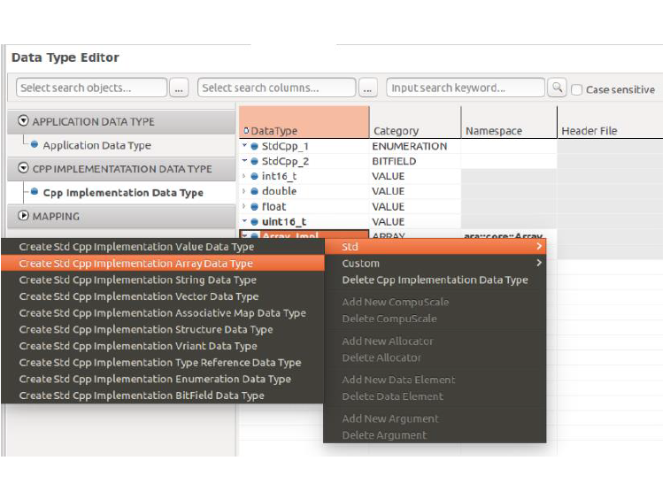
| 4) Change the short name of the Array data type.
| 5) Enter “ara::core::Array” in the Namespace column.
| 6) Enter “TYPE_EMITTER_ARA” in the Type Emitter column.
| 7) Enter value in the +Array > Array Size column.
| 8) Select type in the +Template Arguments > Type column.

| - Creating a two-dimensional array of unit16 elements with arraySize = 5
.. code-block:: C++

    using ArrayRectangularImpl = ara::core::Array<ara::core::Array<uint16_t, 5>, 10>;

| 1) Create a uint16_t data type.
| 2) Create an one-dimensional array with array size 5.
| 3) Create the outer array with size 10 and select **Create Std Cpp Implementation Array Data Type**.
| 4) Change the short name of the array data type.
| 5) Enter “ara::core::Array” in the Namespace column.
| 6) Enter “TYPE_EMITTER_ARA” in the Type Emitter column.
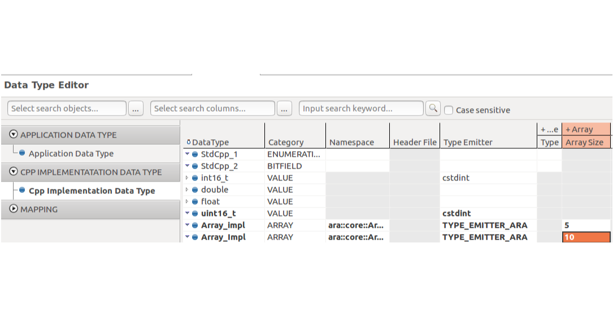
| 7) Select Array_impl in the Template Arguments > Type column. 
|  * ‘Array_impl’ is a short name of one dimension array with array size 5
| 8) Check the check box (set “true”) in the Inplace column
|  * Inplace flag is set to true for the outer array.
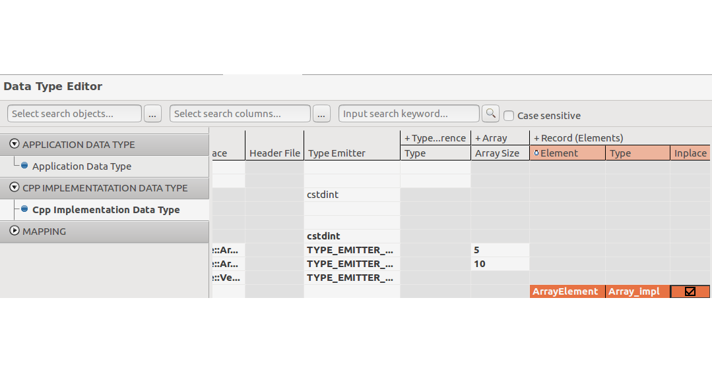

   .. note:: The meaning of the Inplace flag in CppImplementationDataType 
      If CppImplementationDataTypeElement.typeReference.inplace is set to False
      then the shortName of the CppImplementationDataType referenced in the role CppImplementationDataTypeElement.typeReference.typeReference shall be used in the C++ language binding.
      If CppImplementationDataTypeElement.typeReference.inplace is set to True then only the properties of the CppImplementationDataType referenced in the role. 
      CppImplementationDataTypeElement.typeReference.typeReference shall be used in the C++ language binding and the shortName is ignored.
         < from AUTOSAR_TPS_ManifestSpecification>

Vector Data Type
~~~~~~~~~~~~~~~~~~

* Category: VECTOR
* Namespace: ara::core::Vector

| *Example)*
| - An one-dimensional vector of uint16 elements
.. code-block:: C++

   Using templateArgumentDim1 = ara::core::Vector<uint16_t>;

| 1) Create a uint16_t data type.
| 2) Create a Vector data type.
| 2-1) Select **Create Std Cpp Implementation Vector Data Type**.
| 2-2) Change the short name to “templateArgumentDim1”.
| 2-3) Enter “ara::core::Vector” in the Namespace column.
| 2-4) Enter “TYPE_EMITTER_ARA” in the Type Emitter column.
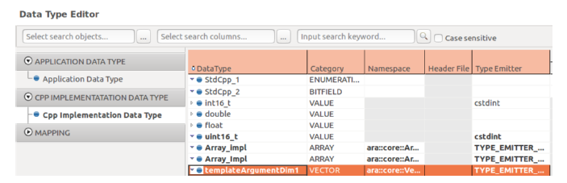

| 2-5) Select uint16_t in the +Template Arguments > Type column.
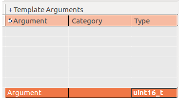

- Creating a multidimensional vector

.. code-block:: c++

   using templateArgumentDim1 = ara::core::Vector<uint16_t>;
   using DynamicDataArrayImplRectangular = ara::core::Vector<templateArgumentDim1>;

| 1) Create a uint16_t data type and one dimensional vector.
| 2) Select **Create Std Cpp Implementation Vector Data Type**.
| 3) Change the short name of Data Type for Vector
| 4) Enter “ara::core::Vector” in the Namespace column
| 5) Enter “TYPE_EMITTER_ARA” in the Type Emitter column.
| 6) Select “templateArgumentDim1” in the +Template Arguments > Type column

   .. note:: “templateArgumentDim1” is the short name of one dimensional vector.

| 7) Check the check box(set “true”) in the Inplace column.

Struct Data Type
~~~~~~~~~~~~~~~~~~

* Category: STRUCTURE

*Example)*

.. code-block:: c++

   struct MyStruct {
   ara::core::uint8_t PrimitiveElement;
   ara::core::Array<uint8_t,5> ArrayElement;
   };

| 1) Create a uint8_t and array data type with size 5.
| 2) Create MyStruct data type.
| 2-1) Select **Create Std Cpp Implementation Structure Data Type**.
| 2-2) Change the short name of the Structure data type.
| 2-3) To add members of the structure, right-click  the Structure data type, and select **Add New Data Element for {…}**.
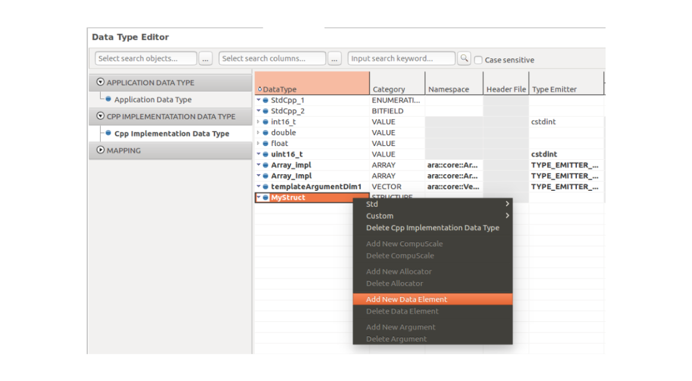

| 2-4) Change the short name to “ArrayElement” in the +Record (Elements) column. This column is for the short name of Member
| 2-5) Select “Arrray_DataType” in the Type column.

   .. warning:: You should create “Array_DataType” first. Please see Chapter 1.1.3 Array Data Type.

| 2-6) Set the check box (set to True) in the Inplace column.
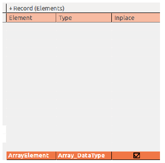

When you set the Inplace flag to True, the structure declaration is generated as follows:

.. code-block:: c++

   struct MyStruct {
   ara::core::uint8_t PrimitiveElement;
   ara::core::Array<uint8_t,5> ArrayElement;
   };

When you set the Inplace flag to False, the array data type is defined outside of the structure as follows:

.. code-block:: c++

   using ArrayDataType = ara::core::Array<uint8_t,5>;
   struct MyStruct {
   std::uint8_t PrimitiveElement;
   ArrayDataType ArrayElement;
   };

Enumeration Data Type
~~~~~~~~~~~~~~~~~~~~~~~

* Category: ENUMERATION

| *Example)*
| 1) Select **Create Std Cpp Implementation Enumeration Data Type**
| 2) Change the short name of the data type to “CylinderType” (Optional).
| 3) Select the Type reference, “uint_8” in the + Type Reference > Type column.
| 4) Change the short name to “Cylinders” in the + CompuMethod > Name column.
| 5) To add members of the Enum, right-click the data type, and select **Add New CompuScale**.
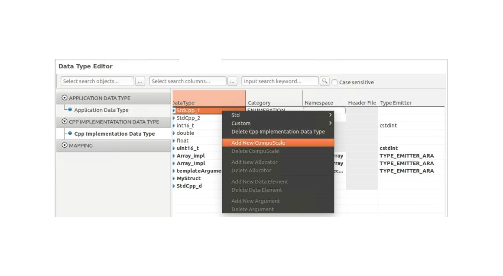

| 6) Type each value in the + CompuMethod.CompuScales column as follows:
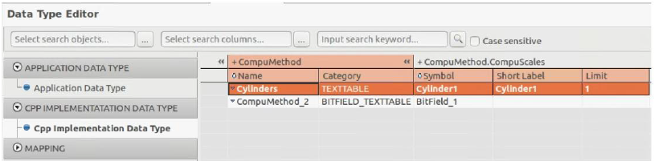

   .. hint:: For the Short Label value, see the following rule for all CompuScales with a point-range: Lower values indicate higher priority. 
      1. Take the value of symbol if this attribute exists. 
      2. Take the value of vt if it makes a valid C identifier. 
      3. Take the value of short Label if it exists.

Map Data Type
~~~~~~~~~~~~~~~~~~~~~~~

* Category: ASSOCIATIVE_MAP
* Namespace: ara::core::Map

| *Example)*
| 1) Select **Create Std Cpp Implementation Associative Map Data Type**.
| 2) Change the short name of Map Data Type.
| 3) Enter “ara::core::Map” in the Namespace column.
| 4) Select the reference type for ASSOCIATIVE_MAP_KEY and ASSOCIATIVE_MAP_VALUE in the +Template Arguments > Type column.
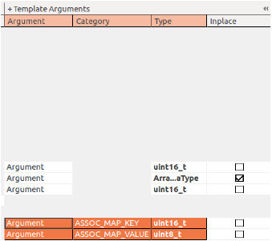

Variant Data Type
~~~~~~~~~~~~~~~~~~~~~~~

* Category: VARIANT
* Namespace: ara::core::Variant

| *Example)* 
| - variant <float, uint8_t>
| 1) Create a float and uint8_t data type.
| 2) Select the Create Std Cpp Implementation Variant Data Type.
| 3) Change the short name of the Variant data type.
| 4) Enter “ara::core:: Variant” in the Namespace column.
| 5) Right-click on the variant data type, and select **Add New Argument**.
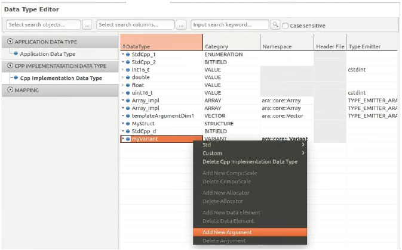
| 6) Select “float” for the type of Argument in the +Template Arguments > Type column.
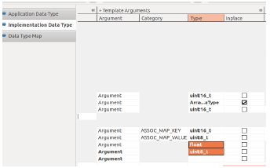

| 7) To add a new argument for variant data type, repeat the step 5) ~ 6) above.

BitField Data Type
~~~~~~~~~~~~~~~~~~~~~~~

* Category: BITFIELD
* Namespace: ara::core::Bitfield

| *Example)*
| 1) Select **Create Std Cpp Implementation BitField Data Type**
| 2) Change the short name of the data type (Optional).
| 3) Select the Type reference, “uint_8” in the + Type Reference > Type column.
| 4) Change the short name in the + CompuMethod column (Optional).
| 5) To add members of the Bitfield, right-click on the data type, and select **Add New CompuScale**.
| 6) Enter proper value in the + CompuMethod.CompuScales column as referring the following table:
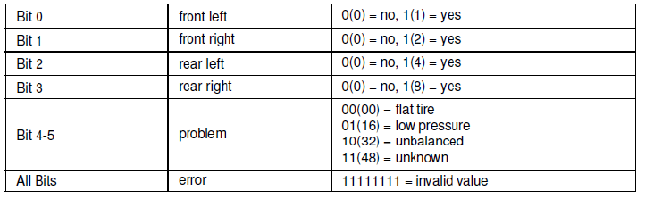

* Internal:
  28 = 0b0001_1100
* Mask: AND operation with this value before it appears as a symbol
  240 = 1111_0000
* In ARXML:
.. code-block:: xml

      <COMPU-METHOD>
      <SHORT-NAME>Texttable</SHORT-NAME>
      <CATEGORY>BITFIELD_TEXTTABLE</CATEGORY>
      <COMPU-INTERNAL-TO-PHYS>
      <COMPU-SCALES>
      <!-- problem -->
      <COMPU-SCALE>
      <SHORT-LABEL>problem</SHORT-LABEL>
      <SYMBOL>problem_low_pressure</SYMBOL>
      <MASK>0b11110000</MASK>
      <LOWER-LIMIT INTERVAL-TYPE="CLOSED">0b00010000</LOWER-LIMIT>
      <UPPER-LIMIT INTERVAL-TYPE="CLOSED">0b00010000</UPPER-LIMIT>
      <COMPU-CONST>
      <VT>low pressure</VT>
      </COMPU-CONST>
      </COMPU-SCALE>