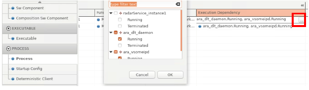

5.3 Application Editor
=======================

Adaptive Application is a set of Executables.
The process of modeling the Adaptive Application is as follows:

| 1. Define AdaptiveApplicationSwComponentType that is type of the Executable.(AdaptiveApplicationSwComponentType is a set of PortPrototypes.)
| 2. Create an Executable for the SwComponent above. 
| 3. Create a Process of the executable and set the Startup Configuration. 
| 4. Map the Process to the Machine. In this step, you can decide on which core to run the process.
| * Prerequisite: You need to create the Machine and Core in the Machine editor.

5.3.1 Software Component
-------------------------------

| 1) To create an Application, create a SW Component first by right-clicking any input cell in the Sw Component tab.

| 2) Add Required Ports, Provided Ports, and Provided-RequiredPorts for the SW Component.
.. image:: ../_static/tool/images/5.3.1_2.png

5.3.2 Executable
-------------------------------

| 1) To Create an Executable, right-click any input cell in the Executable tab.

| 2) Set the attributes of the Executable as follows.

5.3.3 Process
------------------------------

| 1) To create a Process, right-click any input cell in the Process tab. 
| Then, select the Executable for the Process.

 
| 2) Define **State-dependent Startup Configs** for the Process.
|  ① Right-click the Process and select **Add State-dependent Startup Config**.

|  ② Select proper value from each drop-down list of the State-dependent Configs column.

.. warning:: To select proper value for each column,
   you should complete all steps described in Chapter 3.4 Startup Config,
   4.1 Hardware Resource, and 4.6 Machine State.

| - For the States:

| - For the Execution Dependency:

5.3.4 Startup Config
------------------------------

| 1) Create Startup Config in the Process > Startup Config tab.
|  ① Right-click any input cell of the Startup Config tab, and select **Add New Startup Config Set**.

|  ② Right-click the Startup Config set above and select **Add New Startup Config**.

| ③ Set the values for the Startup Config attributes as follows:

Deterministic Client
~~~~~~~~~~~~~~~~~~~~~

| 1) To create Deterministic Client, right-click the Process and select **Add New Deterministic Client**. 
|    You can set Cycle Time, number of Workers.

| 2) To create Deterministic Client Resource, 
| right-click the Process and select **Add New Deterministic Client Resource Need**.
| You can set values for the Resource Needs, Init Resource, and Run Resource as follows.

.. note:: Attributes Information of Deterministic Client Resource Needs

   - InitResource: The computing resource needs of ``DeterministicClient::WaitForNextActivation Kinit`` 
   - RunResource: The computing resource needs of ``DeterministicClient::WaitForNextActivation kRun`` 
   - Each InitResource and RunResource includes number of instructions, sequentialInstructionsBegin
     sequentialInstructionsEnd, and speedup
   - Number of Instructions: the normalized runtime consumption on the target system within 
     one ``DeterministicClient::WaitForNextActivation`` cycle,
     assuming the "worst-case" runtime where the workers would be executed sequentially. 
   - Sequential Instructions Begin: normalized sequential runtime at the beginning of 
     the ``DeterministicClient::WaitForNextActivation`` cycle
     (which mostly cannot be parallelized), before the main usage of the worker pool starts. 
   - Sequntial Instructions End: normalized Instruction at the end of the WaitForNextActivation cycle, 
     after the main usage of the worker pool has ended.

Process-Machine Map
~~~~~~~~~~~~~~~~~~~~~

| 1) To map between a Process and a Machine, 
|    right-click any input cell in the Porcess-Machine Map tab and select **Create Process-Machine Mapping Set**.

| 2) Right-click the Process-Machine Mapping Set and select **Add New Process-Machine Mapping**. 
|    Then you can select Process and Machine for the Mapping.
|    * This means that the Process should run on the selected Machine’s Processor cores.

| 3) Select Process Cores to run on and Processor not to run on.
