5.4 Machine Editor
=====================

5.4.1 Hardware Resource
-------------------------------

| 1) Machine
| To create a Machine, right-click any input cell in the Hardware Resource and select **Create Machine**.
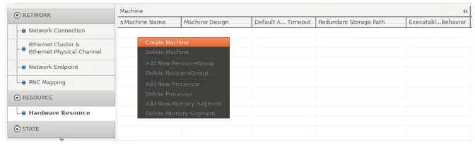

| 2) Machine Design
| After creating a Machine, you can select a Machine Design in the drop-down list of the Machine Design column.

.. note:: Create a Machine Design in Network Connection tab first 
   when you do not see any referable Machine Design in the drop-down list.

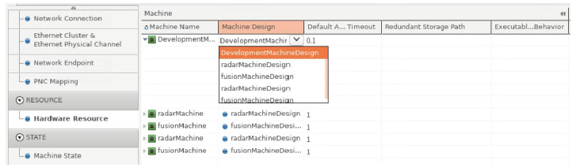

.. hint:: When you do not see any referable Machine Design in the drop-down list, 
   create a Machine Design in the Network Connection tab.

| 3) Processor
| To create a Processor, right- click the Machine and select **Add New Processor**.
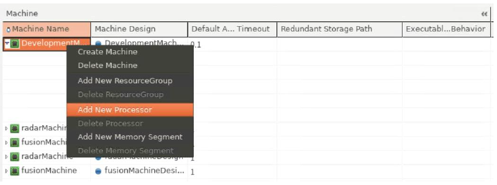

| You can define the value for the Processor and #Cores column, which is located at the far right.
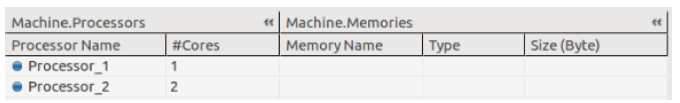

| 4) Memory
| To create Memory, right-click the Machine and select **Add New Memory Segment**.
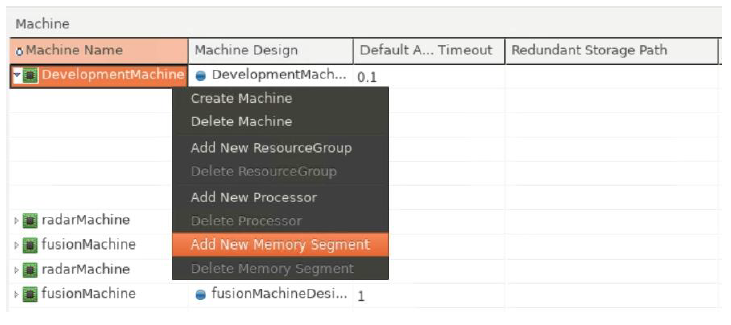

| You can define the value for the Memory, Type, and Size(Byte) column.
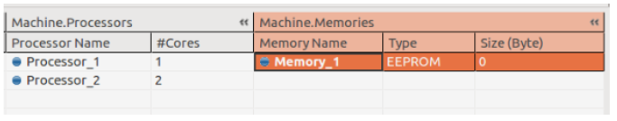

5.4.2 Network Connection
-------------------------------

| 1) Machine Design
| To create a Machine Design, right-click any input cell in the Network Connection tab and select **Create Machine Design**.
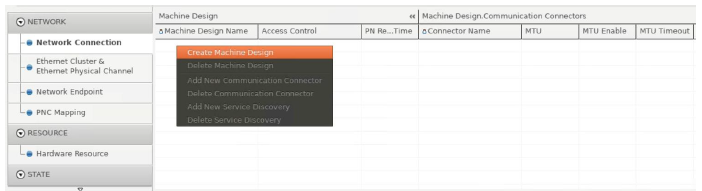

| You can define the value for the Machine Design Name, Access Control, and PN Reset Time column.

| 2) Communication Connector
| To add a Communication Connector(Ethernet Communication Connector), 
| right-click the Machine Design in the Network Connection tab and select **Add New Communication Connector**.
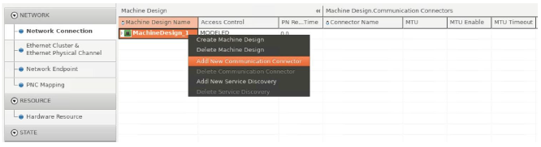
| You can define the value for the Connector Name, MTU, MTU Enable, MTU Timeout, and Unicast Network Endpoint column.

| 3) SOME/IP Service Discovery
| To add a Service Discovery, right-click the Machine Design in the Network Connection tab
| and select **Add New Service Discovery**.
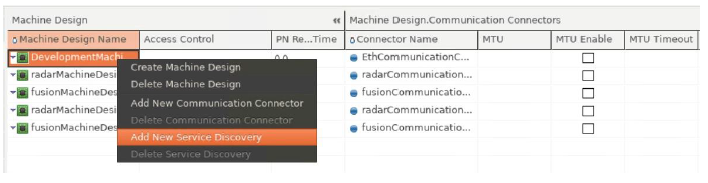
| You can define the value for the Multicast SD IP Address and SOME/IP SD Port column.

5.4.3 Ethernet Cluster & Ethernet Physical Channel
---------------------------------------------------

| 1) Ethernet Cluster
| To create an Ethernet Cluster, right-click any input cell in the Ethernet Cluster & Ethernet Physical Channel tab
| and select **Create Ethernet Cluster**.
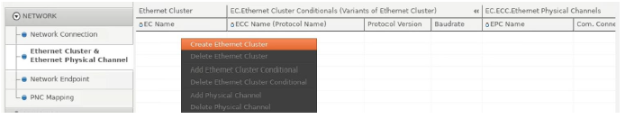

| 2) Ethernet Cluster Conditional(ECC)
| To add an Ethernet Cluster Conditional, right-click the Ethernet Cluster and select **Add Ethernet Cluster Conditional**.
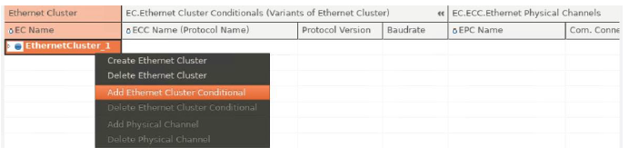

| 3) Ethernet Physical Channel(EPC)
| To add an Ethernet Physical Channel, right-click the Ethernet Cluster Conditional and select **Add Physical Channel**.
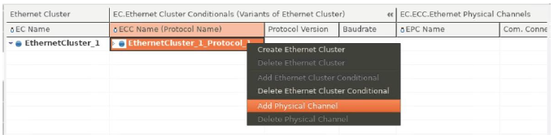

5.4.4 Network Endpoint
---------------------------------------------------

| 1) Network Endpoint
| To Add a Network Endpoint, right-click the Ethernet Physical Channel in the Network Endpoint tab and select **Add Network Endpoint**.
| You can define values for the Network Endpoint Name, FQDN, and Priority column.
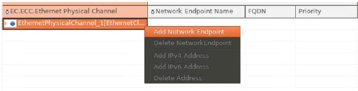

.. hint:: When you do not see any Ethernet Physical Channel 
   in the Network Endpoint tab, create an Ethernet Physical Channel first in the Ethernet Cluster & Ethernet Physical Channel tab.

| 2) Network Endpoint Address
| To add a Network Endpoint Address(IPv4 or IPv6), right-click the Network Endpoint Name
| and select **Add IPv4 Address or Add IPv6 Address**.
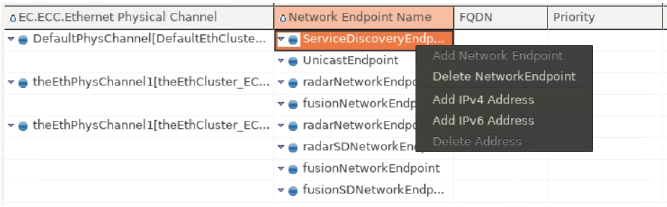

| You can define values for the columns such as Address, Prefix Length(Ipv6)/NetworkMask (Ipv4), 
| and Router(Ipv6)/Gateway(Ipv4), etc.
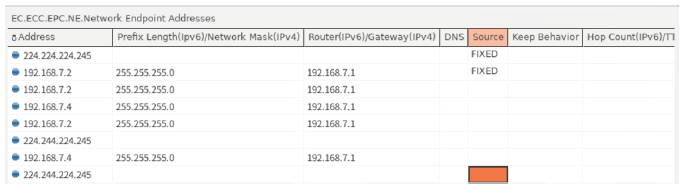

5.4.5 PNC Mapping
--------------------------

| 1) To create a System Mapping to map Partial Network Cluster, create a System first.
| and right-click any input cell in the PNC Mapping tab and select **Create System**.
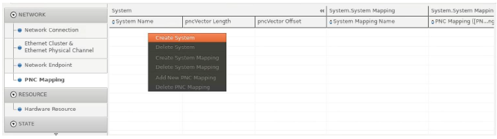

| 2) Right-click the System above and select **Create System Mapping**.

| 3) To create a PNC Mapping, right-click the System Mapping above and select **Add New PNC Mapping**.
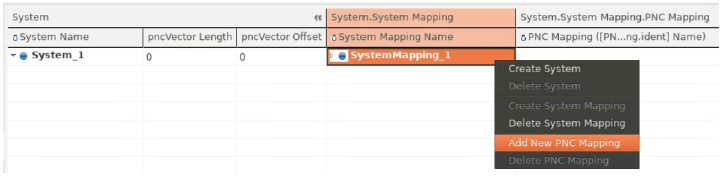

| You can define values for the PNC Mapping Name, Id, Service Instances, Channels column.
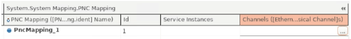

5.4.6 Machine State
--------------------------

| In the Machine State tab, you can see the Machine State, its Function Group,
| and States for the Machine you have created are auto-generated in the Hardware Resource tab as follows.
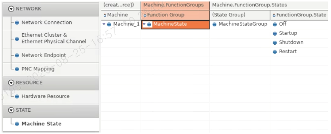

.. warning:: The auto-generated Machine State Function Group
   and default States (Off/Startup/Shutdown/Restart) cannot be deleted.
   
   - You can only add a Function Group and its States. 
   - In case you have imported an ARXML file which has a machine with no Machine State Function Group, 
     it will not be auto-generated without any notification, 
     but the first Function Group you try to add will automatically be the Machine State Function Group. 
   - Only in this case, you can delete the Machine State Function Group
     you have created by pressing the undo key(Ctrl+Z).

| 1) Function Group
| To add a Function Group, right-click the Machine and select **Add New Function Group**.
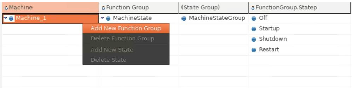

| Then the essential "Off" state is auto-generated for the Function Group, and you can set the short name and further attributes.
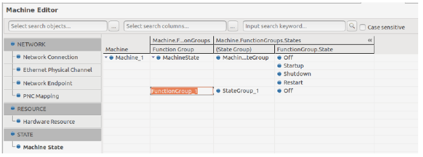

.. note:: The essential default “Off” state of any Function Group cannot be deleted.

| 2) State
| To add a State, right-click the Function Group and select **Add New State**.
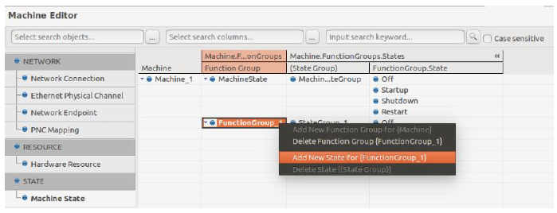
| You can set the short name of the State.