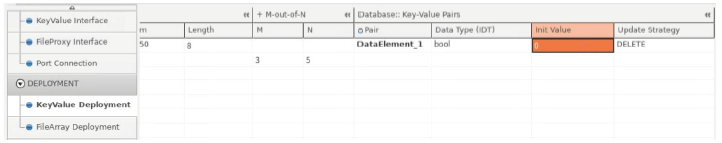

5.5 PER Editor
=====================

Persistency can be divided into three parts including Design, Deployment, and Mapping.

| * In the Design part, you can create Persistency interface.
| If you want to use persistent data in an application, you should use Port Prototype typed by Persistency Interface. 
| The usage of a RPort Prototype indicates that the persistent data can only be read from the persistent storage. 
| The usage of a PPort Prototype indicates that the persistent data can only be written to the persistent storage.
| The usage of a PRPort Prototype indicates that the persistent data can be read from 
| as well as written to the persistent storage.

| * In the Deployment part, you can create persistent storage related to the persistency interface.

| * In the Mapping part, you can map the Deployment and Port (Interface) to a process 
| that is the unit of deployment on the AUTOSAR adaptive platform.

5.5.1 PER Design
~~~~~~~~~~~~~~~~~~

Key-Value Interface
---------------------------

| 1) To create a Key-Value Interface, right-click any input cell in the Key Value Interface tab
| and select **Create Key-Value Interface**. 
| Then you can set the value of Sustained Size, Redundancy, and Update Strategy.

| 2) To create Data Element, right-click the Key-Value Interface and **select Add New Data Element**.

| You can set the value of Data Type (IDT) and Update Strategy.

| 3) Select Data Type (IDT) from the drop-down list. When you do not see any data type to select in the list, 
| you should create it in Data Type Editor first. The Init value of the data type can be set later
| (In the Port Connection tab or Key-Value Deployment tab).

.. note:: In this release version, the Drag & Drop function for selecting data types is not supported in PER Editor. 
   For more details how to use Drag & Drop, see Chapter 4.5.2 in mobilgene A Studio User Guide.

File Proxy Interface
---------------------------

| 1) To create a File Proxy Interface, right-click any input cell in the File Proxy Interface tab
| and select **Create File Proxy Persistency Interface**. Then you can set the value
| of Category, Encoding, Sustained Size, Redundancy, Update Strategy, and Max #Files.

| 2) To create a File Proxy, Select the FileProxy Interface, right click to open action menu 
| and select **Add New File Proxy**. Then you can set the File Proxy name, Content URI, and Update Strategy.

Port Connection
-----------------

| 1) To create a Port Prototype typed by Persistency Interface, right-click the Persistency Interface
| and select **Add New Provided PortPrototype or Add New Required PortPrototype** or **Add New Provided & Required PortPrototype**.

| 2) You can select the SW Component and set the Port and Role, which is automatically generated.
| The type of Port is changed when you change the role of the Port
| (SW Component can be created in Application Editor).

.. warning:: You should create a software component when you do not see any software component in the list. 
   See Chapter 5.3.1 Software Component

| 3) You can set the data element of the Key-Value Interface through ComSpec.
| To create a Com Spec, right-click the SW Component and select **Get All Data Elements from the Persistency Interface**. 
| You can see the Com Specs for each corresponding data element.

| You can set the Init Value of the data element.

| 4) Creating a Port Prototype for the File Proxy Interface is similar to the Key-Value Interface.
| File Proxy Interface does not have an Init Value. 
| So you do not need to create a Com Spec for the File Proxy Interface.

5.5.2 PER Deployment
~~~~~~~~~~~~~~~~~~~~~~~

Key-Value Deployment
----------------------

| 1) To create a Key-Value Database, right-click any input cell in the KeyValue Deployment tab and select **Create Key-Value Database**.

| Then you can set the value of Related Port, on Process, URI, Update Strategy, Max. and Min. Size
| (A specific rule for URI is be explained below).

| 2) You can select for which Port(typed by a Persistency Interface)
| you want to create the Key-Value Database by selecting a Port in the Related Port column.
| It means you can create the Key-Value Database related to the Port you created just before.

| 3) You should select a Process. If you select radarService_instance as below, 
| it means the Key-Value Database is related to the Key-Value Interface(Port Prototype) on the radarService_instance.

| 4) Set the URI of the storage location for the Persistency Key-Value Database.
| The rule for creating URI is
| ``/opt/{shortName in Executable}/var/{shortName of PortPrototype typed by Related Key-Value Interface}.json``
| (This rule applies only to Autron mobilgene Adpaptive)

| 5) 3) To create CRC Redundancy, right-click the Key-Value Database and select **Add New CRC Redundancy Handling**.

| You can select the CRC algorithm. The Length depends on the algorithm.

| 6) 4) To create M-out-of-N Redundancy, right-click the Key-Value Database and select **Add New M-out-of-N Redundancy Handling**.

| You can set the value of M and N.

| 7) 5) To get Key-Value Pair(s) from the Key-Value Interface, 
| right-click the Key-Value Database and select **Generate Key-Value Pairs for from Key-Value Database Interface**.
| If you want to create other Key-Value Pairs, select **Add New Key-Value Pair**.

.. hint:: To add Key-Value Pairs, you need to add a data element for the Key-Value Interface first. 
   See Step 2 in Chapter Key-Value Interface.

| 8) The value of Pair and Data Type matches with the Data Element's key and data type.
| And the Init Value of the data type is copied from the ComSpec in the Port Connection tab.

File Array Deployment
----------------------

| 1) To create a File Array, right-click any input cell in the FileArray Deployment tab and select **Create File Array**.
| Then you can set Interface, on Process, URI, Update Strategy, Max. and Min. Size.

.. note:: The rule for defining URI.(This rule applies only to mobilgene Adaptive) 
   ``/opt/{short name in Executable}/var/{short name of PortPrototype typed by related File Proxy Interface}.json``
   For more information on how to set URI, see Chapter Required Settings in Persistency User Manual.

| 2) Setting the value of CRC and M-out-of-N Redundancy is the same as Key-Value Deployment.
| see Step from 3) to 4) in Chapter Key-Value Deployment.

| To get File(s) from the FileProxy Interface, right-click to open action menu and select **Generate Files from File-Proxy Interface**.
| If you want to create files, select **Add New File.

.. hint:: To get Files, you need to add a new File Proxy for the File Proxy Interface first. 
   See Step 2) in Chapter Key-Value Interface.
   And you need to set the value of Related Port in the File Array Deployment tab.

| 3) You can set File Name, Content URI, and Update Strategy.
| The File and File Name match with the File Proxy's File and File name. 
| And the File Name, Content URI, and Update Strategy are copied from the File Proxy of the File Proxy Interface.

5.5.3 Mapping
~~~~~~~~~~~~~~~~~~~~~~~

| All mappings are created automatically.
| You can check all elements for the modeling Persistency are mapped well in the Deployment-Port tab as follows.

