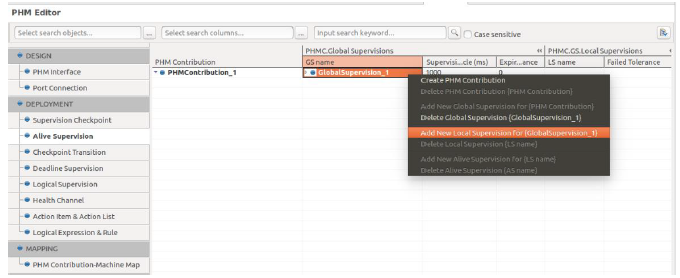
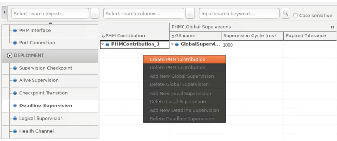
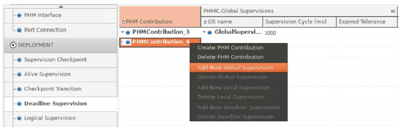
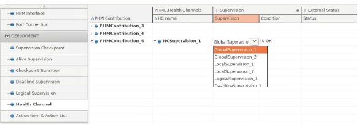

5.6 PHM Editor
=====================

5.6.1 PHM Design
-------------------------------

PHM Interface
~~~~~~~~~~~~~~~~~~~~~~~~~~~~~~~~~~~

| 1) To create a PHM Interface, right-click any input cell in the PHM Interface tab
| and select **Create Supervised Entity Interface** or **Create Health Channel Interface** or **Create Recovery Action Interface**.

| Then you can set the Interface name, Interface ID, and Namespace for the Supervised Entity Interface, 
| Health Channel Interface, and Recovery Action Interface. 

.. hint:: For Recovery Action Interface, yon cannot edit the Interface name and Id

| 2) To create a Checkpoint, right-click the Supervised Entity Interface and select **Add Checkpoint**.

| 3) To create a Health Channel Status, right-click the Health Channel Interface and select **Add Health Channel Status**.

| 4) A Recovery Method is automatically generated when you create a Recovery Action Interface.
| You can set the Interface name and Id for the created Checkpoint, Health Status.

.. hint:: For the created Recovery Method(ClientServerOperation), you cannot edit the name and Id.

Port Connection
~~~~~~~~~~~~~~~~~~~~~~~~~~~~~~~~~~~

| 1) To create a Port Prototype, right-click the PHM Interface in the Port Connection tab and select **Add New PortPrototype**.

| Then you can set the Sw Component and Port name for the created Port Prototype.

5.6.2 PHM Deployment
-------------------------------

Supervision Checkpoint
~~~~~~~~~~~~~~~~~~~~~~~~~~~~~~~~

| 1) To create a PHM Contribution, right- click any input cell and select **Create PHM Contribution**.

.. hint:: Before setting, You should add a Checkpoint and Port Prototype for the PHM Interface first.

.. note:: A related Instance Reference is set internally. 
   In order to be referenced, the Process must be completely set
   (Regarding related settings of Executable, Root SwComponent and PortPrototype). 
   Otherwise, an notification window will pop-up.

Alive Supervision
~~~~~~~~~~~~~~~~~~~

| 1) You can see the PHM Contribution is automatically generated in the Alive Supervision tab,
| which is created from the Supervision Checkpoint tab.
| To create a new PHM Contribution, right-click any input cell and select **Create PHM Contribution**.

| 2) To create a Global Supervision, right-click the PHM Contribution and select **Add New Global Supervision**.

| Then you can set the value of GS name, Supervision Cycle(ms), and Expired Tolerance
| for the created Global Supervision.

| 3) To create a Local Supervision, right-click the Global Supervision and select **Add New Local Supervision**.

| Then you can set the short name and Failed Tolerance for the created Local Supervision. 

.. hint:: The Local Supervision Reference of the Global Supervision is internally set 
   as the Global Supervision that was selected for the creation of the Local Supervision. 
   (<LOCAL-SUPERVISION-REF DEST="LOCAL-SUPERVISION">)

| 4) To create a Alive Supervision, right-click the Local Supervision and select **Add New Alive Supervision**.

| Then you can set the AS name, Supervision Checkpoint, Alive Ref. Cycle, Expected Alive Indication,
| Max and Min Margin for the created Alive Supervision.

.. hint:: The Checkpoint Reference of the created Alive Supervision is set internally 
   as the created Supervision Checkpoint on the left side of the Alive Supervision
   (<CHECKPOINT-REF DEST="SUPERVISION-CHECKPOINT">).

Checkpoint Transition
~~~~~~~~~~~~~~~~~~~~~~~

| In the Checkpoint Transition tab, 
| you can see the Local Supervision created from the Alive Supervision tab.

| 1) To create a Checkpoint Transition, right-click the Local Supervision and select **Add New Checkpoint Transition**.

| Then you can set CT name, Source, and Target.

Deadline Supervision
~~~~~~~~~~~~~~~~~~~~~~~

| In the Deadline Supervision tab, 
| you can see the Local Supervision created from the Alive Supervision tab.

| 1) To create Deadline Supervision, right-click the Local Supervision and select **Add New Deadline Supervision**.

| You can see the PHM Contribution is automatically generated in the Alive Supervision tab,
| which is created from Supervision Checkpoint above.

| 2) To create a PHM Contribution, right-click any input cell and select **Create PHM Contribution**.

| Then you can set the short name for the created PHM Contribution.

| 3) To create a Global Supervision, right-click the PHM Contribution and select **Add New Global Supervision**.

| Then you can set the GS Name, Supervision Cycle(ms), and Expired Tolerance 
| for the created Global Supervision.

| 4) To create a Local Supervision, right-click the Global Supervision and select **Add New Local Supervision**.

| Then you can set LS Name and Failed Tolerance for the created Local Supervision. 

.. hint:: The Local Supervision Reference of the Global Supervision is internally set 
   as the Global Supervision that was selected for the creation of the Local Supervision. 
   (LOCAL-SUPERVISION-REF DEST="LOCAL-SUPERVISION">)

| 5) To create Deadline Supervision, right-click the Local Supervision and select **Add New Deadline Supervision**.

| Then you can set the DS name, Checkpoint Transition, Max and Min Deadline 
| for the created Deadline Supervision.

.. hint:: The Checkpoint Transition Reference of the created Deadline Supervision is internally set
   as the created Checkpoint Transition on the left side of the Deadline Supervision. 
   (<CHECKPOINT-TRANSITION-REF DEST="CHECKPOINT-TRANSITION">)

Logical Supervision
~~~~~~~~~~~~~~~~~~~~~~~

| In the Logical Supervision tab, you can see the Local Supervision created from the Alive Supervision tab.
| To create a new PHM contribution, start with creating a Global Supervision 
| and proceed with step 1) ~ 3) in Deadline Supervision above.

| To create a Logical Supervision, right-click the Local Supervision and select **Add New Logical Supervision**.

| Then you can set the LGS name, Initial Checkpoints, Final Checkpoints, and Transitions 
| for the created Logical Supervision.

Health Channel
~~~~~~~~~~~~~~~~~~~~~~~

You can see the PHM Contributions created from other tabs above.

| 1) To create PHM Contribution, right-click any input cell and select **Create PHM Contribution**.

| Then you can set the short name for the created PHM Contribution.

| 2) To create a Health Channel, right-click the PHM Contribution 
| and select **Add New Health Channel Supervision** or **Add New Health Channel External Status**.

| Then you can set the HC name for the created Health Channel.

| 3) After creating a Health Channel Supervision, you can set the Supervision and Condition
| (defining which condition shall trigger this Health Channel).

| 4) After creating a Health Channel External Status in step 2), 
| you can set the Process Reference, Status, and Condition 
| (defining which condition shall trigger this health channel).

.. warning:: To reference a Status for the Health Channel External Status, 
   you should create a PHM Health Channel Interface and add Health Channel Status for the Interface
   in the PHM Interface tab first.

   To reference a Process for the Health Channel External Status, 
   you should set the target Status first and a Process must be completely set in Application Editor.
   (See setting the SwComponent, Executable, and Process tab in Application Editor) 
   Also, you should add a new Port Prototype with the Sw Component for the PHM Health Channel Interface
   in the Port Connection tab of PHM Editor or in the Sw component tab of Application Editor. 
   
.. hint:: For user convenience of setting above,
   a hovering function for the Process value is provided as follows:

Action Item & Action List
~~~~~~~~~~~~~~~~~~~~~~~~~~~

| You can see the PHM Contributions created from other tabs above.

| 1) To create PHM Contribution, right-click any input cell and select **Create PHM Contribution**.

| Then you can set the short name for the created PHM Contribution.

| 2) To create an Action Item, right-click the PHM Contribution and select one of the following menus.
| **Add New Process Action Item** or
| **Add New Platform Action Item** or
| **Add New Watchdog Action Item** or
| **Add New Application Mode Request Action Item** or
| **Add New Function Group Mode Request Action Item** or
| **Add New RecoveryViaApplicationAction**.

Then you can set the AI name and Type for the created Action Item.

| 3) To create Action List, right-click the PHM Contribution and select **Add New Action List**.

| Then you can set the AL name and Execution Semantic, and Action Items.

| 4) In case of Process PHM Action Item,
| you can set the Process for the Reference of the created Process PHM Action Item.

| 5) In case of the Application Mode Request PHM Action Item or Function Group Mode Request PHM Action Item type,
| you can set the Base, Mode Group, and Mode for the Application Mode Request PHM Action Item 
| or Function Group Mode Request PHM Action Item .
|   * When you set the Mode Group value first, the corresponding Base value is set automatically.

Logical Expression & Rule
~~~~~~~~~~~~~~~~~~~~~~~~~~~

| You can see the PHM Contributions created in other tabs above.

| 1) To create PHM Contribution, right-click any input cell and select **Create PHM Contribution**.

Then you can set the short name for the created PHM Contribution.

| 2) To create a Logical Expression, right-click the PHM Contribution and select **Add New Logical Expression**.

| Then you can set the LE name and Operator for the created Logical Expression.

| 3) For further settings, you can set the + Arguments > Health Channels
| and Other Logical Exps value for the Logical Expression.

| 4) To create a Rule, right-click the PHM Contribution and select **Add New Rule**.

| 5) Then you can set the Rule name, Logical Expression, Init State, True Action List, and False Action List value 
| for the created Rule.

5.6.3 Mapping
----------------------

PHM Contribution - Machine
~~~~~~~~~~~~~~~~~~~~~~~~~~~~

| 1) To create a PHM Contribution-Machine Mapping (mapping of PHM Contributions to Machines), 
| right-click any input cell and select **Create PHM Contribution-Machine Map**.

| Then you can set the Mapping name, Machine, PHM Contributions for the created PHM Contrib|ution-Machine Map.

RecoveryViaApplicationAction - ClientServerOperation
~~~~~~~~~~~~~~~~~~~~~~~~~~~~~~~~~~~~~~~~~~~~~~~~~~~~~~~

| 1) To create a RecoveryViaApplicationAction – ClientServerOperation Mapping, right-click any input cell 
| and select **Create RecoveryViaApplicationAction–ClientServerOperation Map**.

| Then you can set the Mapping name, RecoveryViaApplicationAction, and Process for the created Mapping.

.. warning:: The Process must be completely set (Regarding related settings of Executable, Root SwComponent and PortPrototype) 
   to be referenced, and the ClientServerOperation(Recovery Method) of the PhmRecoveryActionInterface typed 
   as PPort must be connected to this Process.