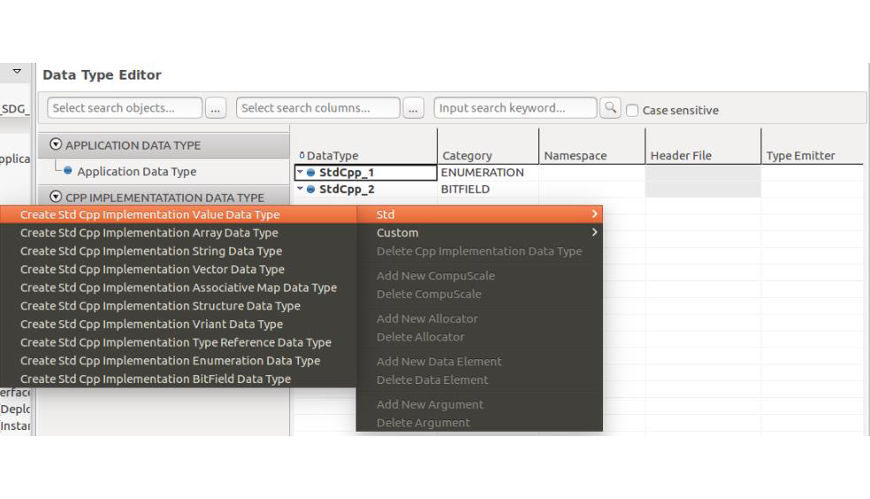
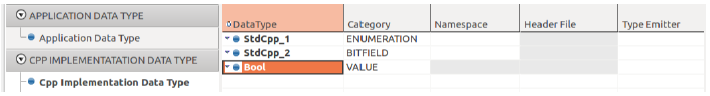
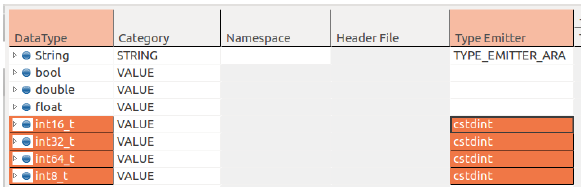
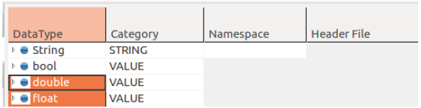

5.8 IAM Editor
=====================

5.1.1 Implementation Data Type
-------------------------------

Primitive Implementation Data Type
~~~~~~~~~~~~~~~~~~~~~~~~~~~~~~~~~~~

* Category: VALUE
The primitive data types like Boolean, fixed-width integer data types and floating-point data types are described as CppImplementationDataTypes of category **VALUE**.

You can create primitive data types manually as example below.

| *Example)*
| - **Bool**
| 1) Click any input cell in Grid View and select **Std > Create Std Cpp Implementation Value Data Type**.

| 2) Change the short name in the DataType column to “Bool”.

| - **Signed Integer (int8_t/16_t/32_t/64_t)**
| 1) Select **Create Std Cpp Implementation Value Data Type**.
| 2) Change the short name in the **DataType** column as follows:
     - E.g. “int16_t” for the data type int16_t
| 3) Enter "cstdint" in the Type Emitter column for the data type above.

| - **Unsigned Integer**
| 1) Select **Create Std Cpp Implementation Value Data Type**.
| 2) Change the short name in Data Type column as follows:
| - “uint8_t” for the data type uint8_t
| - “uint16_t” for the data type uint16_t
| - “uint32_t” for the data type uint32_t
| - “uint64_t” for the data type uint64_t
| 3) Enter "cstdint" in the Type Emitter column as the case of **Signed Integer** above.

| - **Floating point types**
| 1) Select **Create Std Cpp Implementation Value Data Type**.
| 2) Change the short name in the DataType column as follows:
| - “float” for the data type float.
| - “double” for the data type double.

String Data Type
~~~~~~~~~~~~~~~~~~

* Category: STRING
* Namespace: ara::core::String

| *Example)*
| 1) Select Create Std Cpp Implementation String Data Type.
2) Change the short name of the String data type (Optional).
3) Enter “ara::core::String” in the Namespace column.
4) Enter "TYPE_EMITTER_ARA" in the Type Emitter column

